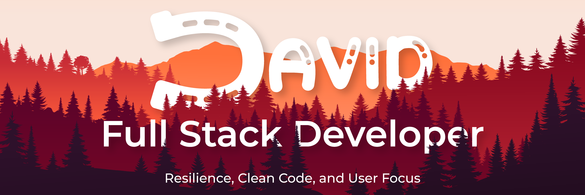

<!-- BANNER SUPERIOR -->

  

<h1 align="center">
  Hi, I'm David Vargas 🐎
</h1>

  
  

 

<!-- ABOUT ME / PHILOSOPHY -->
<h2 align="center">🌵 Philosophy: From Customer Service to Code</h2>

<table align="center">
<tr>
<td width="100%" valign="top">
After mastering <b>Customer Service and Customer Experience for over 6 years</b>, I uncovered a fundamental truth: <i>great customer service begins with software that doesn't frustrate the user.</i>  
I transitioned into <b>Full Stack Development</b> with a precise objective: <b>building the SaaS applications companies need to revolutionize customer interaction.</b> I approach software engineering with a focus on simple interfaces, logical workflows, robust backend systems, and secure execution from the first click.  
Bridging my operational background with modern web technologies and a foundational roadmap toward <b>cybersecurity and pentesting</b>, I ensure that the user experience is always backed by resilient, impenetrable architectures.
</td>
</tr>
</table>

 

<!-- TECH STACK -->
<h2 align="center">🛠️ The Tech Stack</h2>

| 🎨 Frontend | ⚙️ Backend & Data | 🛡️ Management & Security |
| :---: | :---: | :---: |
|    |    |   |

 

<!-- FEATURED PROJECTS -->
<h2 align="center">🤠 Featured Projects</h2>

  <i>A showcase of digital solutions built by combining robust architectures, a CX mindset, and intuitive interfaces.</i>

|  |  |
| :---: | :---: |

 

<!-- STATS -->
<h2 align="center">📊 GitHub Activity</h2>

  

 

<!-- CONTRIBUTION SNAKE -->
<h2 align="center">🐍 Contribution Graph</h2>

  <picture>
    <source media="(prefers-color-scheme: dark)" srcset="https://raw.githubusercontent.com/D-a-v-i-d-Vargas/D-a-v-i-d-Vargas/output/github-contribution-grid-snake.svg">
    <source media="(prefers-color-scheme: light)" srcset="https://raw.githubusercontent.com/D-a-v-i-d-Vargas/D-a-v-i-d-Vargas/output/github-contribution-grid-snake.svg">
    
  </picture>

 

  <i>"In code as on the ranch, true craftsmanship demands discipline, clean execution, and systems built to last."</i>  
  <b>Open to collaborations. Let's build together!</b>

